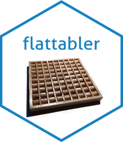

<!-- README.md is generated from README.Rmd. Please edit that file -->

```{r, include = FALSE}
knitr::opts_chunk$set(
  collapse = TRUE,
  comment = "#>"
)
```

# flattabler <a href="https://josesamos.github.io/flattabler/"></a>

<!-- badges: start -->
[](https://CRAN.R-project.org/package=flattabler)
[](https://github.com/josesamos/flattabler/actions/workflows/R-CMD-check.yaml)
<!-- badges: end -->

<!-- [](https://app.codecov.io/gh/josesamos/flattabler?branch=master) -->

Pivot tables are generally used to present raw and summary data. They are generated from spreadsheets and, more recently, also from R ([`pivottabler`](https://CRAN.R-project.org/package=pivottabler)).

If we generate pivot tables from our own data, `flattabler` package is not necessary. But, if we get data in pivot table format and need to represent or analyse it using another tool, this package can be very helpful: It can save us several hours of programming or manual transformation.

`flattabler` package offers a set of operations that allow us to transform one or more pivot tables into a flat table. 


## Installation

You can install the released version of `flattabler` from [CRAN](https://CRAN.R-project.org) with:

``` r
install.packages("flattabler")
```

And the development version from [GitHub](https://github.com/) with:

``` r
# install.packages("devtools")
devtools::install_github("josesamos/flattabler")
```

## Example

A pivot table contains label rows and columns, and an array of values, usually numeric data. It can contain additional information, such as table header or footer.

Below is an example of a pivot table obtained from the [`pivottabler`](https://CRAN.R-project.org/package=pivottabler) package. It is included in `flattabler` package in the form of the variable `df_pivottabler`, defined as a data frame.

```{r, results = "asis", echo = FALSE}
library(flattabler)
pander::pandoc.table(tibble::as_tibble(df_pivottabler), split.table = Inf)
```

The transformation to obtain a flat table from the previous pivot table using `flattabler` package is as follows:

```{r}
library(flattabler)

ft <- pivot_table(df_pivottabler) |>
  define_labels(n_col = 2, n_row = 2) |>
  fill_labels() |>
  remove_agg() |>
  fill_values() |>
  unpivot(na_rm = TRUE)
```

The result is a `tibble` object that can be further transformed, for example, by the `dplyr` package to remove the added data.

```{r}
ft <- ft |>
  dplyr::filter(col2 != "Total") |>
  dplyr::filter(row2 != "Total")
```

The result obtained is as follows:

```{r, results = "asis", echo = FALSE}
pander::pandoc.table(ft, split.table = Inf)
```

Once we have defined the necessary transformations for a pivot table, we can apply them to any other with the same structure. Candidate tables can have different number of rows or columns, depending on the number of labels, but they must have the same number of rows and columns of labels, and the same number of header or footer rows, so that the transformations are the same for each table.

To easily perform this operation, we define a function `f` from the transformations, as shown below.

```{r}
f <- function(pt) {
  pt |>
    set_page(1, 1) |>
    define_labels(n_col = 2, n_row = 2) |>
    remove_top(1) |>
    fill_labels() |>
    remove_agg() |>
    fill_values() |>
    remove_k() |>
    replace_dec() |>
    unpivot()
}

folder <- system.file("extdata", "csvfolder", package = "flattabler")
lpt <- read_text_folder(folder)

lft <- flatten_table_list(lpt, f)

lft
```

In this way we can generate a flat table from a list of pivot tables. The list of pivot tables is generated using package functions to import them from various data sources.

